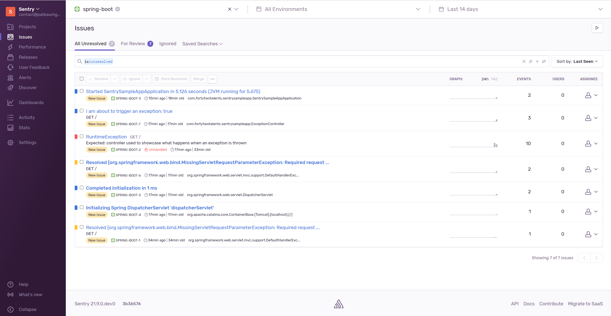

# blog-sentry-with-spring-boot

Spring Boot provides everything a developer needs to bootstrap modern applications. Operational aspects are not omitted but delegated to third-party services and tools.

Sentry helps us according to their website with:

> From error tracking to performance monitoring, developers can see what matters, solve quicker, and learn continuously about their applications - from the frontend to the backend.

We can leverage the Sentry integration with Spring Boot to send the data directly to, e.g. a self-hosted Sentry instance.

The next steps are providing some insights into how to set up Sentry, and then we will produce some Exceptions and Logs that we can see in Sentry afterwards.

## Self-Hosted Sentry

Sentry offers and maintains a minimal setup that works out-of-the-box for simple use cases. For example, we can use Docker and Docker Compose along with a bash-based install and upgrade script.

## Install Sentry on-premise

> Attention: At the time of writing, you should use a Docker Version >= 19.03.6 and Docker Compose >= 1.28.0. Beta versions or pre-releases are not supported.

1. Checkout the repository with `git clone https://github.com/getsentry/onpremise.git`
1. Change to the `onpremise` folder and run `./install.sh` to prepare and execute the installation.

```bash
Workstation ➜ onpremise git:(master) ./install.sh
▶ Parsing command line ...

▶ Setting up error handling ...

▶ Checking minimum requirements ...

▶ Creating volumes for persistent storage ...
Created sentry-clickhouse.
Created sentry-data.
Created sentry-kafka.
Created sentry-postgres.
Created sentry-redis.
Created sentry-symbolicator.
Created sentry-zookeeper.

▶ Ensuring files from examples ...
Creating ../sentry/sentry.conf.py...
Creating ../sentry/config.yml...
Creating ../symbolicator/config.yml...
Creating ../sentry/requirements.txt...

▶ Generating secret key ...
Secret key written to ../sentry/config.yml

▶ Replacing TSDB ...
```

1. You will have to set up a user too. Running the command with `./install.sh --no-user-prompt` let's you do this later. _In case you have issues with WSL and the install script, use this approach too._

Please visit the [Sentry documentation](https://develop.sentry.dev/self-hosted/) for everything else.

After Successfully installing Sentry, you need to run, if not done yet already the user creation.

1. Run the following command to create one yourself: `docker-compose run --rm web createuser`

Btw., a nice trick to generate passwords on the command line is `openssl rand -base64 32`.

1. The script told you to run `docker-compose up -d' to start Sentry.

1. Sentry binds to port `9000` by default. You can reach the login page at `http://127.0.0.1:9000`

> If the installation fails, start with a fresh checkout since the installation script creates config files in the git repo. Btw. Git won't show changes !!!

## How to configure Sentry Spring Boot Starter

Adding Sentry to your Spring Boot applications is done in two steps:

Add `sentry-spring-boot-starter` as a dependency to `pom.xml`. Since it's not available through [start.spring.io](https://start.spring.io) we have to add a version. Because Spring Boot uses Logback, for logging, by default, we also add the `sentry-logback` implementation.

```xml
<dependency>
    <groupId>io.sentry</groupId>
    <artifactId>sentry-spring-boot-starter</artifactId>
    <version>5.1.1</version>
</dependency>
<dependency>
    <groupId>io.sentry</groupId>
    <artifactId>sentry-logback</artifactId>
    <version>5.1.1</version>
</dependency>
```

We need to set the `sentry.dsn` property in the `applications.properties`. Head over to [http://localhost:9000/organizations/sentry/projects/](http://localhost:9000/organizations/sentry/projects/) and create a new project.

```properties
# Make sure you use your one.

sentry.dsn=http://a7b20699de7a40b3b1f87adf39f9d0a7@localhost:9000/2
```

If you are curious what you need to see most of the features for a development and test environment running, you might consider adding a `git-commit-id-plugin` to your spring boot app. Sentry will use the Git Commit ID as a "release" in the dashboard.

```xml
<plugin>
    <groupId>pl.project13.maven</groupId>
    <artifactId>git-commit-id-plugin</artifactId>
</plugin>
```

Adding `sentry.debug=true` to the `application.properties` is helpful during development to see what is going over the wire.

If you are adding `sentry.logging` properties you can influence the which logs are sent to Sentry.

And last but not least sampling rates: `sentry.sample-rate` between 0..1 how many per cent of errors are sampled. Where as `sentry.traces-sample-rate` is for performance monitoring to identify slow requests.

In the example app, but also in the snippet below, you find links to the documentation, which explains even more.

```properties
# Sentry Spring Boot Documentation - https://docs.sentry.io/platforms/java/guides/spring-boot/
sentry.debug=true

sentry.dsn=http://a7b20699de7a40b3b1f87adf39f9d0a7@localhost:9000/2

# Logging - https://docs.sentry.io/platforms/java/guides/spring-boot/logging-frameworks/
sentry.logging.enabled=true

sentry.logging.minimum-event-level=info
sentry.logging.minimum-breadcrumb-level=debug

# Sampling - https://docs.sentry.io/platforms/java/guides/spring-boot/configuration/sampling/
sentry.sample-rate=1

# Performance Monitoring - https://docs.sentry.io/platforms/java/guides/spring-boot/performance/
sentry.traces-sample-rate=1
```

To play around, we produced a sample app which helps with a rest endpoint to produce Exceptions which will be then reported. Just call `http://localhost:8080/?name=Me&triggerException=true` and see the RuntimeException flying.

Having a look into Sentry's Issue dashboard result could look like this.



Enjoy experimenting!

The complete source code is available on our [Github Repository](https://github.com/42talents/blog-sentry-with-spring-boot).

If you are interested to learn more about Spring and Spring Boot, [get in touch and have a look at our training courses!](https://42talents.com/en/training/in-house/Spring-Core/)
